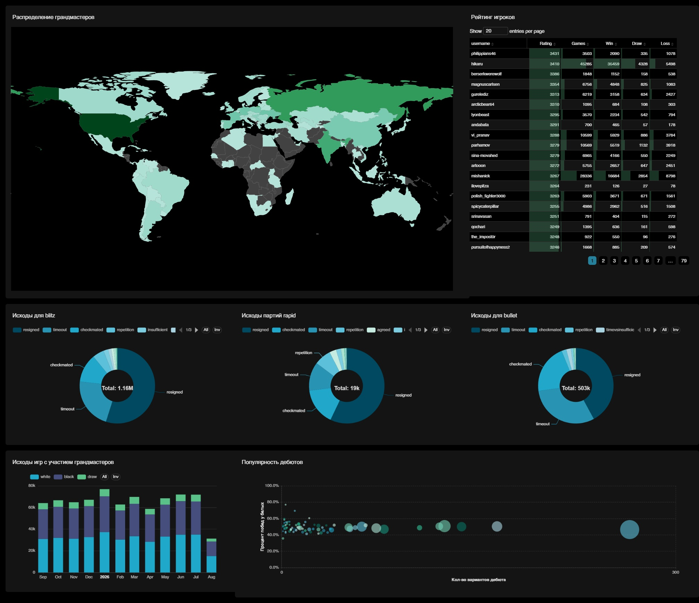
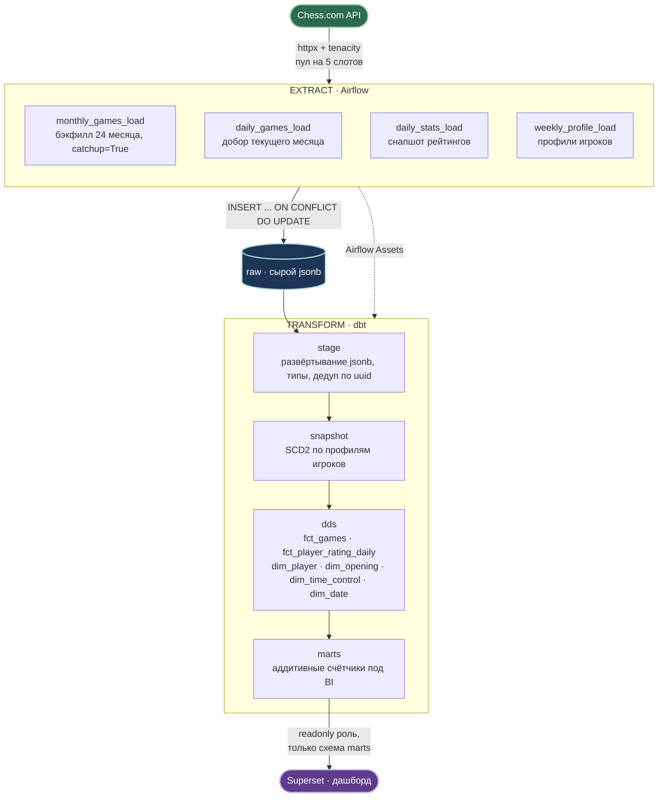
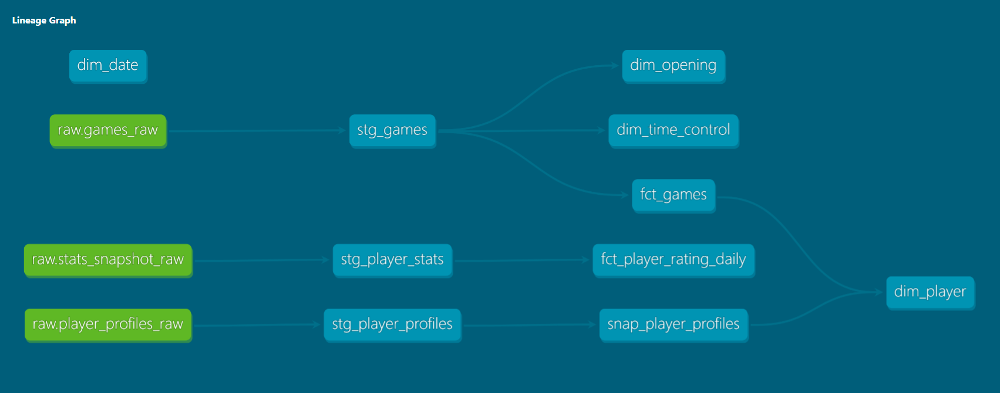
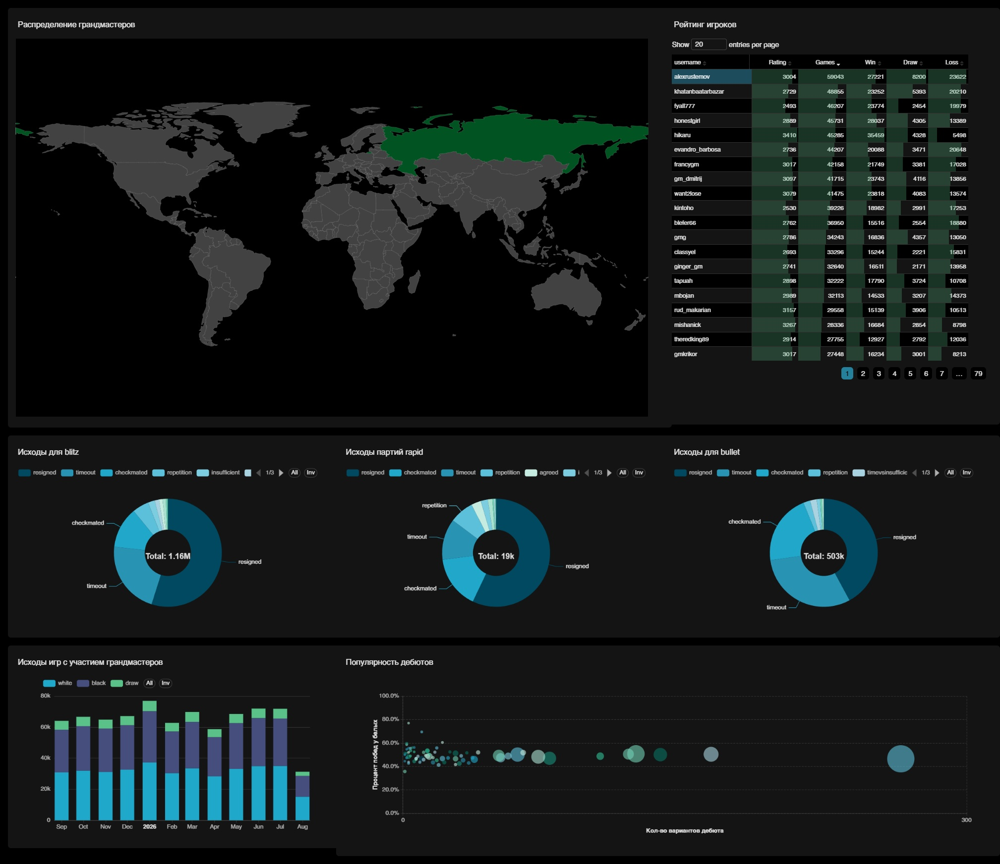

# Chess.com ELT Pipeline

[](https://www.chess.com/news/view/published-data-api)


ELT-пайплайн, который ежедневно забирает партии гроссмейстеров с Chess.com,
складывает их в PostgreSQL с историей изменений, пересчитывает витрины через dbt
и показывает дашборд в Superset. Весь стек поднимается одной командой.



---

## На какие вопросы отвечает

- Какие дебюты в моде у гроссмейстеров и как эта мода меняется по месяцам
- Насколько велико преимущество белых и одинаково ли оно в разных контролях
- Чем чаще заканчиваются партии - матом, сдачей, просрочкой - и как на это
  влияет ускорение контроля
- Какой рейтинг и счёт побед у гроссмейстера на сегодня

## Запуск

Нужны Docker и Docker Compose. Всё остальное поднимется само.

```bash
git clone https://github.com/Stenzyz/chess-elt-pipeline.git
cd chess-elt-pipeline

cp .env.example .env
make gen-keys          # скопировать вывод в .env, дозаполнить пароли и User-Agent

make                   # build -> up -> wait -> db-migrate
```

После этого:

| Сервис | Адрес | Доступ |
|---|---|---|
| Airflow | http://localhost:8080 | из `.env` |
| Superset | http://localhost:8088 | из `.env` |
| PostgreSQL (`chess_dwh`) | `localhost:5433` | из `.env` |
| dbt docs | http://localhost:8081 |

Дальше в Airflow включить DAG-и - начнётся бэкфилл. Дашборд в Superset
собирается вручную (см. [Дашборд](#дашборд)).

### Команды Makefile

| Цель | Что делает |
|---|---|
| `make` / `make init` | полное развёртывание с нуля |
| `make up` / `make down` | поднять / остановить контейнеры |
| `make clean` | снести всё вместе с данными (спросит подтверждение) |
| `make db-migrate` | прогнать SQL-скрипты из `sql/` |
| `make dbt-build` | прогнать dbt вручную |
| `make dbt-refresh` | то же с `--full-refresh` |
| `make test` / `make lint` | pytest / ruff |

## Архитектура



Граф зависимостей dbt-моделей:



Подробнее: [`docs/star_schema.md`](docs/star_schema.md) - модель данных и принятые
компромиссы, [`docs/scope.md`](docs/scope.md) - границы проекта и особенности
источника, [`docs/data_dictionary.md`](docs/data_dictionary.md) - словарь полей.

## Слои данных

**`raw`** - ответ API как есть, в `jsonb`. Уникальный ключ `(username, archive_month)`,
запись через `INSERT ... ON CONFLICT DO UPDATE`. Повторный запуск за тот же период
не создаёт дублей - это база для идемпотентности всего пайплайна.

**`stage`** - развёртывание `jsonb_array_elements`, приведение типов, дедупликация
по `uuid` (партия между двумя GM лежит в архивах обоих), парсинг дебюта из ECO-ссылки
и контроля времени из строки вида `600+5`.

**`dds`** - звезда Кимбалла. Зерно `fct_games` - одна партия, модель инкрементальная
по `end_time`. `dim_player` строится поверх SCD2-снапшота профилей
(`dbt snapshot`, стратегия `check`). Второй факт - `fct_player_rating_daily`
с зерном игрок + дата + класс контроля, с дельтами рейтинга через `LAG()`.

**`marts`** - витрины под дашборд. Хранят **аддитивные счётчики**, а не готовые доли:
BI-инструмент пересчитывает проценты сам на любом уровне группировки, тогда как
предвычисленный ratio ломается при агрегации грубее исходного зерна.

## DAG-и

| DAG | Расписание | Что делает |
|---|---|---|
| `monthly_games_load` | `@monthly`, `catchup=True` | бэкфилл истории, dynamic task mapping по чанкам игроков |
| `daily_games_load` | `@daily` | добор текущего незакрытого месяца |
| `daily_stats_load` | `@daily` | снапшот рейтингов всех игроков |
| `weekly_profile_load` | `@weekly` | профили игроков для SCD2-измерения |
| `dbt_transform` | по Assets | `staging` -> `snapshot` -> `dds` -> `marts` |

`dbt_transform` не висит на cron - он подписан на Airflow Assets и стартует, когда
оба ежедневных extract-DAG-а реально закончили работу. События эмитятся из терминальной
задачи после всех mapped-инстансов, иначе триггер срабатывал бы после первого чанка.

Параллелизм к API ограничен пулом на 5 слотов. Падения уходят в Telegram через
`on_failure_callback`.

## Дашборд



Superset подключается к базе под отдельной ролью с правами `SELECT` только на схему
`marts` (`sql/04_superset_readonly_user.sql`, включая `ALTER DEFAULT PRIVILEGES`
для будущих витрин). Подключение регистрируется автоматически при старте
`superset-init`, дашборд собирается вручную.

## Объём

| Метрика | Значение |
|---|---|
| Игроков | ~1719 (тег GM, список живой) |
| Глубина истории | 24 месяца |
| Партий в `fct_games` | ~1.7 млн |
| Размер `raw.games_raw` | ~3.3 ГБ |

## Структура репозитория

```
chess-elt-pipeline/
├── src/chess_loader/        клиент Chess.com API и загрузчик в raw
│   ├── client.py            httpx + tenacity, троттлинг, обработка 404/429
│   └── loader.py            upsert в raw-таблицы
├── dags/                    Airflow
│   ├── load_*_dag.py        четыре extract-DAG-а
│   ├── dbt_transform_dag.py трансформации, триггерится по Assets
│   ├── assets.py            определения Assets для cross-DAG триггеров
│   ├── shared_tasks.py      общие таски и default_args
│   └── callbacks.py         уведомления в Telegram
├── dbt/chess_dbt/
│   ├── models/staging/      stg_games · stg_player_stats · stg_player_profiles
│   ├── models/dds/          факты, измерения, тесты
│   ├── models/marts/        витрины под дашборд
│   ├── snapshots/           SCD2 по профилям игроков
│   └── macros/              generate_schema_name
├── sql/                     DDL схем, raw-таблиц, readonly-роли для BI
├── superset/                Dockerfile и superset_config.py
├── tests/                   pytest на клиент и загрузчик
├── docs/                    scope · словарь данных · схема звезды · линейдж
├── docker-compose.yml       весь стек, включая БД метаданных
└── makefile                 развёртывание одной командой
```

## Что оказалось сложнее, чем ожидалось

**Список гроссмейстеров - живой.** `/pub/titled/GM` отдаёт актуальный список на момент
запроса, а не снимок. Поэтому строгая идемпотентность недостижима: при повторной загрузке
прошлого месяца может добавиться игрок, получивший тег за это время (в бэкфилл он не попадёт).
Идемпотентность гарантируется на уровне записи (`ON CONFLICT`), а не на уровне общего счётчика.

**Каст `timestamptz::date` зависит от таймзоны сессии.** Один и тот же запрос из
DBeaver (`Europe/Moscow`) и из контейнера (`Etc/UTC`) давал расхождение в сотни партий
на границе месяца. Лечится настройкой временного пояса в инструменте для работы с БД.

**Предвычисленные доли в витринах ломают BI.** Первая версия витрин хранила
`win_rate` и `share_of_month`. Superset, агрегируя их на более грубом уровне,
считал среднее от процентов без учёта веса - арифметически неверно. Переделано
на сырые счётчики, проценты считает BI.

**Изменение логики в staging требует `--full-refresh` вниз по графу.** После правки
регулярки разбора дебюта `fct_games` осталась инкрементальной со старыми значениями,
и `relationships`-тест поймал 36 тысяч осиротевших ссылок на `dim_opening`.
Тесты dbt тут отработали ровно как задумано.

## Что сделал бы иначе

- Парсинг дебюта живёт в `stg_games`, а группировка в семейства - в `dim_opening`,
  то есть две регулярки одна поверх другой. Чище было бы держать в staging сырую
  ECO-ссылку, а обе производные считать в одном месте.
- `dim_player` строится из `fct_games`, а не независимо - сознательный компромисс
  ради полноты покрытия (в партиях есть соперники без профилей), но это нарушает
  классический порядок «измерения раньше фактов».
- Дашборд не воспроизводится из репозитория: `export-dashboards` завязан на UUID
  подключения, который на чистой машине генерируется заново. При росте проекта
  стоило бы решить это аккуратно.
- Вынес бы в облако. Локальный Docker Compose удобен для разработки и для того,
  чтобы проект запускался у любого проверяющего, но у него есть потолок: raw-слой
  на 3+ ГБ jsonb лежит в той же OLTP-базе, что и витрины; полный пересчёт
  `stg_games` упирается в память одной машины; секреты лежат в `.env` вместо
  секрет-менеджера. В облачном варианте raw уехал бы в объектное хранилище
  в Parquet, аналитика - в колоночную СУБД, оркестрация - в managed Airflow,
  секреты - в секрет-менеджер провайдера. Тогда же имеет смысл вернуться
  к вопросу об изоляции dbt (отдельный под вместо общего образа с Airflow).