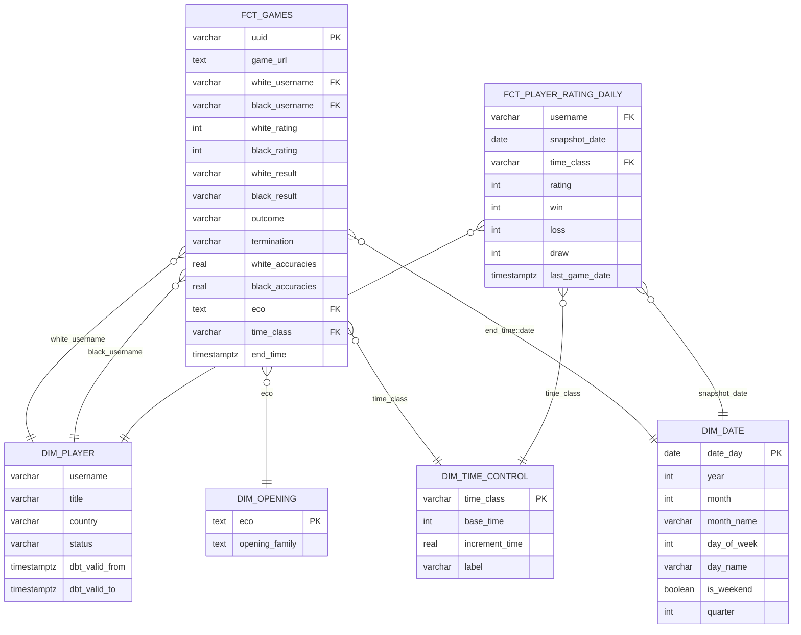

# Звезда (dds-слой)

## Зерно таблиц фактов

- `fct_games` - одна строка = одна партия
- `fct_player_rating_daily` - одна строка = игрок + дата снимка +класс контроля

Две таблицы фактов с разной гранулярностью.

## Схема

## Решения и компромиссы

**Денормализация.** `white_username`, `black_username`, `eco`, `time_class` хранятся в факте текстом, а не суррогатными ключами. Причина: объём умеренный (~1.9 млн партий), Postgres нормально справляется с JOIN, но большинство витрин обходятся без них вовсе, если нужные поля уже лежат в факте.

**`dim_player` через SCD2.** Титул, страна и статус меняются редко, поэтому историчность через `dbt_valid_from`/`dbt_valid_to`. Джойн с фактом идёт с учётом периода действия версии, а не просто по `username`.

**Рейтинг - снапшотом, не SCD2.** Рейтинг меняется после каждой партии, вести его через SCD2 породило бы миллионы версий. Поэтому отдельная таблица фактов с ежедневным срезом.

**`dim_time_control` по `time_class`.** Ключ — класс контроля (rapid/blitz/bullet), а не конкретная комбинация секунд, потому что витрины оперируют классами. `base_time`/`increment_time` остаются как атрибуты измерения.