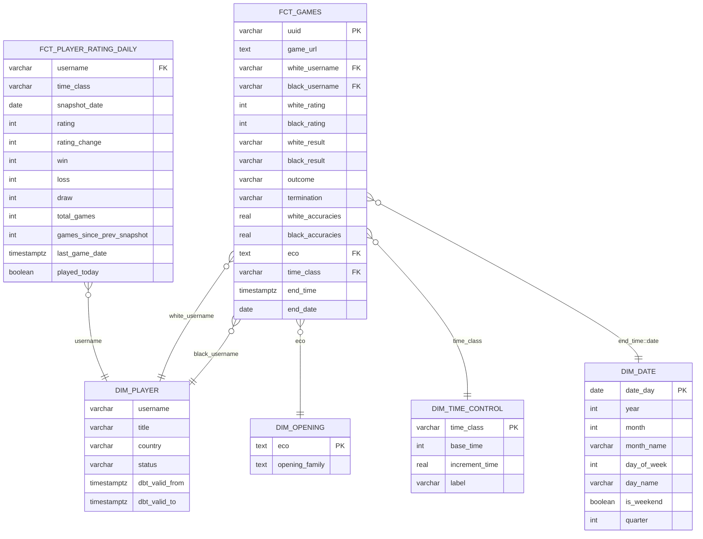

# Звезда (dds-слой)

## Зерно таблиц фактов

- `fct_games` - одна строка = одна партия
- `fct_player_rating_daily` - одна строка = игрок + дата снимка + класс контроля

## Схема

## Решения и компромиссы

**Денормализация.** `white_username`, `black_username`, `eco`, `time_class` хранятся в факте текстом, а не суррогатными ключами. Причина: объём умеренный (~1.9 млн партий), Postgres нормально справляется с JOIN, но большинство витрин обходятся без них вовсе, если нужные поля уже лежат в факте.

**`dim_player` покрывает всех, но атрибуты только у GM.** Партии включают соперников, которые не входят в scope загрузки профилей (только гроссмейстера из titled/GM). Чтобы relationships-тест на fct_games не терял связь для большинства партий, dim_player строится как UNION всех username из fct_games с LEFT JOIN к снапшоту профилей (snap_player_profiles) - игроки без профиля получают NULL в title/country/status но остаются в измерении. Историчность (SCD2) живёт в snap_player_profiles отдельно; dim_player берёт только текущую версию (dbt_valid_to IS NULL).

**Рейтинг - отдельная факт-таблица с зерном игрок+дата+класс контроля.** Изначально рассматривал `fct_player_rating_daily` как прямую копию staging-модели без архитектурной пользы. Решение поменял: staging-модель (`stg_player_stats`) даёт только распакованные значения из API, а факт-таблица считает то, чего в источнике нет - дельту рейтинга и число партий с прошлого снимка через `LAG()`, и флаг `played_today` (играл ли игрок в день снимка). Материализация `table`, не `incremental`: строк на порядки меньше, чем в fct_games, а `LAG()` при инкрементальном пересчёте не увидит предыдущую строку из старого батча без доп. окна. `time_class` пока без relationships-теста к dim_time_control - можно добавить позже, сейчас есть только accepted_values.

**`dim_time_control` по `time_class`.** Ключ - класс контроля (rapid/blitz/bullet), а не конкретная комбинация секунд, потому что витрины оперируют классами. `base_time`/`increment_time` остаются как атрибуты измерения.

**`fct_games` инкрементальна.** В отличие от рейтингов, партии - тяжёлая трансформация (jsonb-разворачивание по 1.9+ млн строк), полный пересчёт при каждом запуске был бы дорогим. `materialized='incremental'`, `unique_key='uuid'`, фильтр по `end_time` новее максимума в уже существующей таблице.