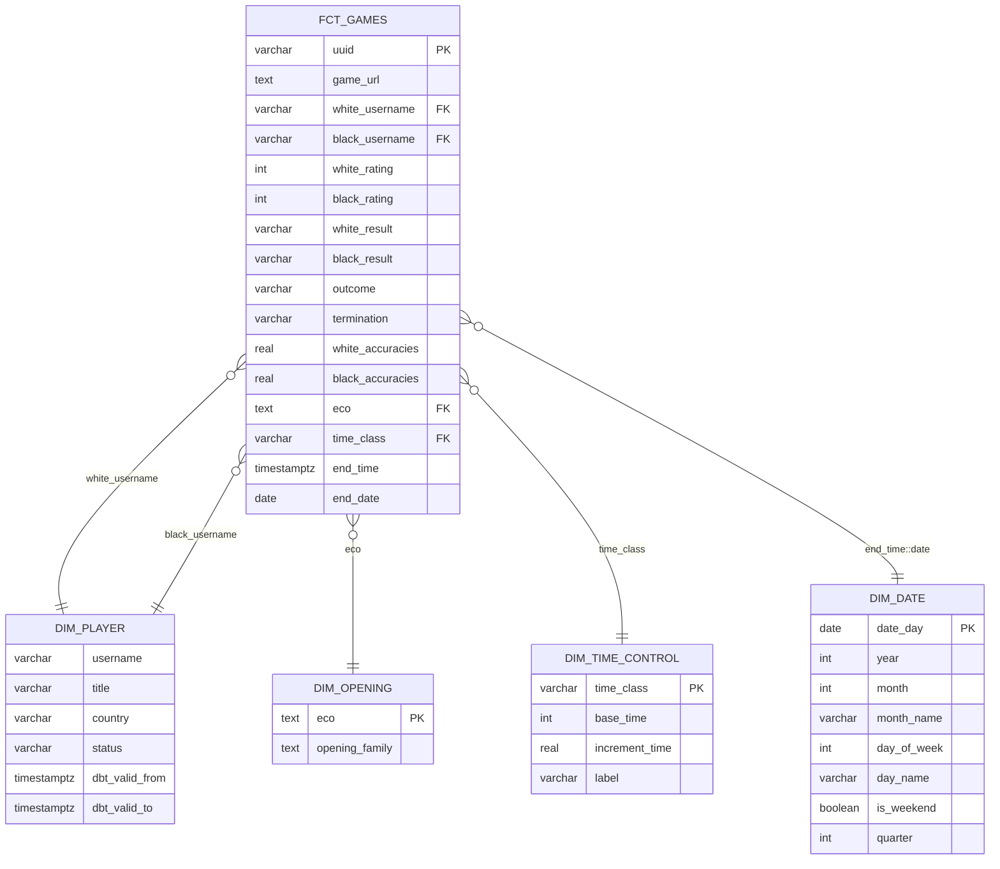

# Звезда (dds-слой)

## Зерно таблицы фактов

- `fct_games` - одна строка = одна партия

## Схема

## Решения и компромиссы

**Денормализация.** `white_username`, `black_username`, `eco`, `time_class` хранятся в факте текстом, а не суррогатными ключами. Причина: объём умеренный (~1.9 млн партий), Postgres нормально справляется с JOIN, но большинство витрин обходятся без них вовсе, если нужные поля уже лежат в факте.

**`dim_player` через SCD2.** Титул, страна и статус меняются редко, поэтому историчность через `dbt_valid_from`/`dbt_valid_to`. Джойн с фактом идёт с учётом периода действия версии, а не просто по `username`.

**Рейтинг - снапшотом, без отдельного fct-слоя.** Рассматривал `fct_player_rating_daily` как вторую таблицу фактов с другим зерном (игрок + дата + класс контроля), но staging-модель (`stg_player_stats`) уже даёт это зерно напрямую, без тяжёлых вычислений поверх raw. Отдельная dds-модель была бы буквальной копией staging без архитектурной пользы (не нужна инкрементальность, не требуется стабилизировать интерфейс от сложной трансформации) - решил не плодить прослойку ради методологии и оставить `stg_player_stats` как источник для будущих витрин напрямую.

**`dim_time_control` по `time_class`.** Ключ - класс контроля (rapid/blitz/bullet), а не конкретная комбинация секунд, потому что витрины оперируют классами. `base_time`/`increment_time` остаются как атрибуты измерения.

**`fct_games` инкрементальна.** В отличие от рейтингов, партии - тяжёлая трансформация (jsonb-разворачивание по 1.9+ млн строк), полный пересчёт при каждом запуске был бы дорогим. `materialized='incremental'`, `unique_key='uuid'`, фильтр по `end_time` новее максимума в уже существующей таблице.